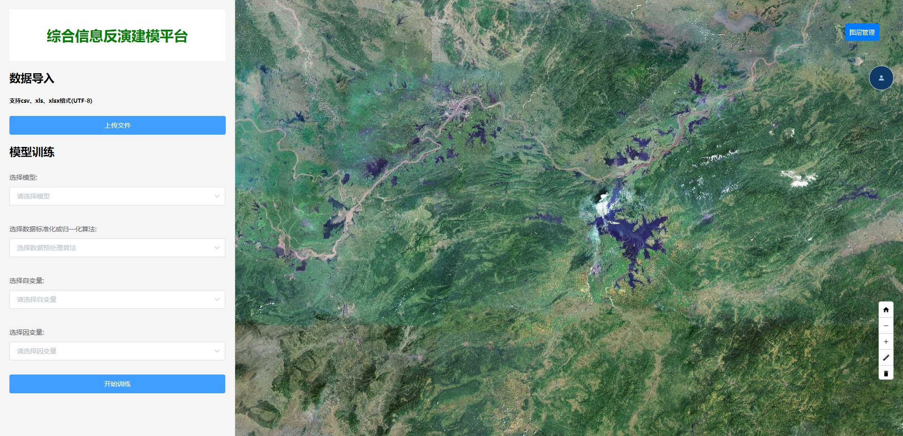

# 信息反演建模平台

该项目是一个综合信息反演建模平台，包含后端 Python 和前端 Vue2 构建的界面，用户可以通过前端界面上传数据，支持excel和csv格式，运行模型并查看结果。


## 目录结构

### 后端（app文件夹下）

```
- config/             # 配置文件目录，存储模型参数和环境设置
- models/             # 存储训练好的模型
- result/             # 训练和推理结果的存储目录
- units/              # 辅助工具模块，包含通用功能函数
- upload_data/        # 用户上传数据的存放目录
- main.py             # 项目主程序入口
```

### 前端（vue文件夹下）

```
- .vscode/            # VSCode 编辑器相关配置
- dist/               # 编译后的静态文件
- node_modules/       # Node.js 依赖模块
- public/             # 公共静态资源
- src/                # 前端源代码
- jsconfig.json       # JavaScript 项目配置
- package.json        # 项目依赖和脚本配置
- package-lock.json   # 锁定依赖版本
- vue.config.js       # Vue 项目配置文件
```

## 环境要求

### 后端

- Python 3.x
- 依赖库：
  - numpy
  - pandas
  - scikit-learn
  - TensorFlow 或 PyTorch

可以使用以下命令安装后端依赖：

```bash
pip install -r requirements.txt
```

### 前端

- Node.js 版本 14 或更高
- npm 或 yarn 包管理器

可以使用以下命令安装前端依赖：

```bash
npm install
```

## 后端使用说明

### 1. 数据上传
将待处理数据上传到 `upload_data/` 目录，支持 CSV、Excel 格式。

### 2. 配置模型
在 `config/` 目录中，配置模型的参数和路径。

### 3. 运行主程序
通过命令行执行 `main.py` 文件，启动后端服务：

```bash
cd ./app
python main.py
```

### 4. 查看结果
运行结束后，处理结果将保存在 `result/` 目录中。

## 前端使用说明

### 1. 启动开发服务器
前端开发环境可以通过以下命令启动：

```bash
cd ./vue
npm run serve
```

服务器启动后，可以在浏览器中访问 `http://127.0.0.1:8080` 查看项目。

### 2. 编译项目
如果需要部署，可以使用以下命令编译项目为静态文件：

```bash
npm run build
```

编译后的文件将存放在 `dist/` 目录下。

## 贡献

如果您希望为该项目贡献代码，请遵循以下步骤：

1. Fork 本仓库
2. 创建新分支 (`git checkout -b feature-branch`)
3. 提交更改 (`git commit -am '添加新功能'`)
4. 推送分支 (`git push origin feature-branch`)
5. 提交 Pull Request

## 许可证

该项目遵循 MIT 许可证。

### 说明：
- **后端** 依赖库可以根据实际项目的需求进行调整。
- **前端** 可以根据开发和部署需求自定义。
